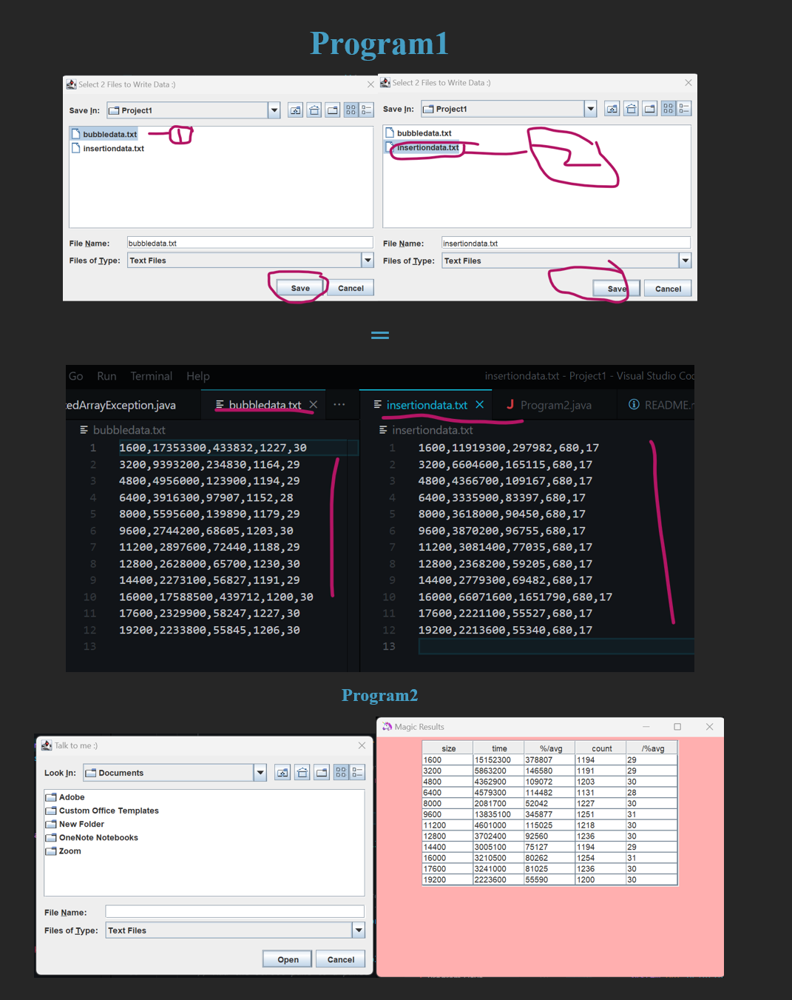

# Welcome to Our Humble Sorting Tester
The purpose of this program is to test out two sorting algorithms.
This is to check which one is more efficient.

## Program 1
- Program1.java
- Opens new file chooser.
- Gets 2 files to write on from user.
- Generates random data.
- Computes the analytics.
- Writes the analytics.

```
          Program 1
              |
AbstractSort - Unsorted Array Exception
   |      |
Bubble    Insertion
```
**To use:**
1. Run
2. Select one file and save.
3. Select second file and save.
4. Go look at text files.

## Program 2
- Program2.java
- Asks user for which file to read.
- Opens a new window.
- Shows the results in a table.

**To use:**
1. Select text file to read.
2. Look at populated table.





<!-- 👣FOOTER👣 -->
&nbsp;
<hr />
<p align="center">A work by <a href="https://github.com/xtina-lt/">Christina Torres</a></p>
<p align="center"><span style="color: #808080;"><em>xtina_lt@outlook.com</em></span></p>

<!-- Add icon library -->
<link rel="stylesheet" href="https://cdnjs.cloudflare.com/ajax/libs/font-awesome/4.7.0/css/font-awesome.min.css">

<!-- Add font awesome icons -->
<p style="text-align: center;">
    <a href="https://www.linkedin.com/in/xtinacodes/" class="fa fa-linkedin"></a>
    <a href="https://github.com/xtina-lt/" class="fa fa-github"></a>
</p>

&nbsp;